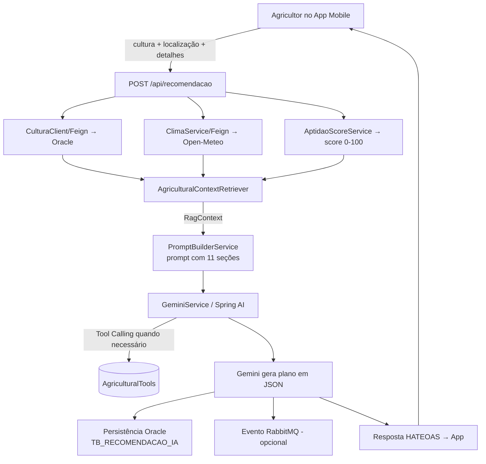

# 🌵 Akaru — Assistente Agrícola Inteligente

### Disruptive Architectures: IoT, IoB & Generative IA — FIAP Global Solution 2026/1
### Trilha escolhida: **IA Generativa**

> **Akaru** — *Plantio inteligente, colheita certa.* Uma plataforma que usa IA generativa
> para transformar dados climáticos e agronômicos em recomendações de plantio em
> linguagem natural, voltada à agricultura familiar brasileira. Projeto alinhado ao
> **ODS 2 — Fome Zero e Agricultura Sustentável**.

---

## 👥 Integrantes

| Nome | RM | Papel no Akaru |
|---|---|---|
| Luann Noqueli Klochko | RM560313 | App mobile React Native |
| Juan Pablo Rebelo Coelho | RM560445 | API .NET — gestão de usuários, plantios e histórico |
| Lucas Higuti Fontanezi | RM561120 | Banco de dados Oracle PL/SQL |
| Victor Rodrigues De Lima Lourenco | RM560087 | API Java + integração Gemini + DevOps Azure |
| Renato Silva Alexandre Bezerra | RM560928 | Arquitetura (TOGAF/ArchiMate) + Disruptive IA Generativa |

---

## 1. Descrição da solução

Pequenos agricultores brasileiros frequentemente plantam fora da época ideal por falta de
acesso a orientação técnica regionalizada. O Akaru resolve isso combinando dados reais
(clima em tempo real + requisitos agronômicos das culturas) com um modelo de IA generativa
que gera planos de plantio e responde dúvidas em linguagem simples.

A solução cobre as **10 culturas mais plantadas pela agricultura familiar brasileira**:
Milho, Feijão, Mandioca, Tomate, Arroz, Batata, Alface, Cebola, Pimentão e Melancia.

A IA generativa aparece em **dois pontos** da aplicação:

| Componente | Endpoint | O que faz |
|---|---|---|
| **Motor de Recomendação** | `POST /api/recomendacao` | Gera um plano de plantio estruturado (época, espaçamento, irrigação, alertas, cuidados) usando RAG + Tool Calling + Gemini |
| **Chatbot IAkaru** | `POST /api/iakaru/chat` | Assistente conversacional que responde dúvidas agrícolas livres em linguagem natural |

---

## 2. Por que a trilha IA Generativa

A solução usa o **Google Gemini** como modelo de linguagem generativo para produzir texto em
linguagem natural a partir de contexto estruturado — exatamente o que define a trilha de IA
Generativa (chatbots, assistentes inteligentes e processamento contextual das informações).

Diferenças em relação a ML tradicional:

- **ML tradicional** prevê um valor ou classe a partir de um modelo treinado em dados históricos.
- **IA Generativa** produz conteúdo novo (texto) condicionado a um contexto montado em tempo de execução — sem necessidade de treinar um modelo próprio.

No Akaru, o score de aptidão (0–100) é calculado de forma **determinística** (regra de negócio),
e o Gemini é responsável apenas por **gerar a explicação e o plano em linguagem natural** — uma
divisão clara entre cálculo e geração.

### Por que o Gemini

- Acesso gratuito via **Google AI Studio** (free tier), adequado a um projeto acadêmico
- Integração nativa com **Spring AI** através do endpoint OpenAI-compatível do Google
- Capacidade multimodal (texto e imagem) para evolução futura (diagnóstico de doenças por foto)

---

## 3. Arquitetura da solução

A aplicação segue arquitetura de **microserviços**, com a camada de IA concentrada no
serviço de recomendação.

```
┌──────────────────────────┐
│   App Mobile (React Native / Expo)            │
│   github.com/luannoq/Projeto-mandacaru        │
└───────────────┬──────────────────────────────┘
                │ HTTPS + JWT
                ▼
┌──────────────────────────────────────────────┐
│   akaru-recomendacao-service  (porta 8082)    │
│   • Motor de Recomendação (RAG + Tools)       │
│   • Chatbot IAkaru                            │
│   • Spring AI 1.0.0 → Gemini                  │
└───┬───────────────┬───────────────┬──────────┘
    │               │               │
    ▼               ▼               ▼
┌─────────┐   ┌────────────┐   ┌──────────────┐
│ Oracle  │   │ Open-Meteo │   │  Gemini API  │
│ (culturas)│ │  (clima)   │   │ (Google AI)  │
└─────────┘   └────────────┘   └──────────────┘
    ▲
    │ Feign
┌───┴───────────────────────────┐
│ akaru-catalogo-service (8081) │
│ • Catálogo das 10 culturas    │
└───────────────────────────────┘
```

### Fluxo completo da IA — entrada → processamento → saída



### Componentes de IA

**RAG (Retrieval-Augmented Generation) — estruturado**
O `AgriculturalContextRetriever` recupera dados reais de fontes confiáveis e os consolida
em um `RagContext` antes de chamar o modelo. As fontes são:

| Fonte | Dados recuperados |
|---|---|
| Oracle (via catalogo-service) | Nome, ciclo, temperatura min/máx, chuva ideal, tipo de solo |
| Open-Meteo | Temperatura média 7 dias, precipitação prevista, umidade |
| Input do agricultor | Localização (lat/lon, cidade, estado), detalhes da propriedade |
| AptidaoScoreService | Score 0–100 + classificação ALTA / MEDIA / BAIXA |

É uma alternativa válida ao RAG por embeddings/vector store, adequada quando as fontes são
APIs estruturadas e consultáveis.

**Tool Calling**
A classe `AgriculturalTools` expõe três ferramentas que o Gemini pode invocar durante a geração:

| Ferramenta | Descrição |
|---|---|
| `consultarCultura(culturaId)` | Busca dados da cultura no Oracle |
| `consultarClima(lat, lon)` | Busca clima no Open-Meteo (com cache) |
| `calcularScoreAptidao(culturaId, lat, lon)` | Cálculo determinístico local |

**Prompt Engineering**
O `PromptBuilderService` monta um prompt rico em 11 seções (identidade, dados da cultura,
contexto climático, requisitos ideais, localização e instruções de formato de saída em JSON),
garantindo respostas consistentes e estruturadas.

O agente de IA também possui um **system prompt** configurado no Google AI Studio, que define
sua identidade, regras de comportamento, a base de conhecimento das 10 culturas e um módulo de
diagnóstico visual de doenças por imagem. O system prompt completo está documentado em
[`System_Prompt/system_prompt_akaru.md`](System_Prompt/system_prompt_akaru.md).

---

## 4. Tecnologias utilizadas

| Categoria | Tecnologia |
|---|---|
| Linguagem | Java 17 |
| Framework | Spring Boot 3 (Web, Security, Data JPA, Validation) |
| IA | Spring AI 1.0.0 → Google Gemini (endpoint OpenAI-compatível) |
| Banco de dados | Oracle Autonomous Database (AKARUGSDB) |
| Mensageria | RabbitMQ |
| Integração externa | OpenFeign (Open-Meteo, catalogo-service) |
| Segurança | Spring Security + JWT |
| Documentação API | Swagger / OpenAPI |
| Cache | Spring Cache (endpoint de clima) |
| Cloud | Azure App Service for Containers + Azure Container Registry |
| CI/CD | Azure DevOps (Pipelines de Build e Release) |
| Mobile | React Native + Expo |

---

## 5. Instruções de uso

A forma recomendada de testar a solução é pelo **aplicativo mobile (APK)**, que consome a
API hospedada no Azure. O backend no Azure **não possui interface web** — ele expõe apenas
a API REST e o Swagger para inspeção técnica.

### 5.1. Testar pelo aplicativo (recomendado para avaliação)

> 📱 **Download do APK (Android):** https://github.com/Renato-005/Akaru-GS-IOT/releases/download/v1.0.0/APK.AKARU.apk

**Como instalar:**

1. Baixe o arquivo `APK.AKARU.apk` no celular Android.
2. Abra o arquivo para iniciar a instalação.
3. Ao aparecer o aviso *"App bloqueado pelo Play Protect"*, toque em **"Mais detalhes"** e depois em **"Instalar mesmo assim"**. Esse aviso é normal para qualquer app instalado fora da Play Store — não indica problema no aplicativo.
4. Abra o app, crie uma conta e use.

> ⏱️ **Cold start:** a primeira requisição (login, lista de culturas) pode demorar de 10 a 30
> segundos, pois o backend no Azure "acorda" após inatividade. A partir da segunda requisição
> o tempo de resposta volta ao normal.

O app já vem apontado para a API de produção no Azure — basta instalar e usar.

**Fluxo de uso no app:**

1. Cadastrar-se / fazer login (recebe um token JWT)
2. Na Home, ver o resumo climático da região
3. Em "Nova análise", escolher uma das 10 culturas e informar a localização
4. Receber o plano de plantio gerado pela IA na tela de Resultado
5. Conversar com o chatbot **IAkaru** para tirar dúvidas livres
6. Consultar recomendações anteriores no Histórico

### 5.2. Inspecionar a API diretamente (Swagger)

O backend está publicado em containers no **Azure App Service**. Não há frontend web — para
testar os endpoints diretamente, use o Swagger:

| Serviço | URL de produção |
|---|---|
| Recomendação + Chatbot IAkaru | `https://app-akaru-recomendacao-hjhecqd7hsfrdhcv.southafricanorth-01.azurewebsites.net` |
| Catálogo de culturas | `https://app-akaru-catalogo-cyfgd4ejadfpefhc.southafricanorth-01.azurewebsites.net` |

- **Swagger UI:** adicione `/swagger-ui/index.html` ao final da URL do serviço
- **Health check:** adicione `/actuator/health` ao final da URL

> Pelo Swagger é possível registrar um usuário, obter o token JWT, autorizar e então testar
> os endpoints de IA (`/api/iakaru/chat` e `/api/recomendacao`) sem precisar do app.

### 5.3. Repositórios do projeto

| Componente | Repositório |
|---|---|
| Arquitetura + Disruptive IA (esta entrega) | `https://github.com/Renato-005/Akaru-GS-IOT` |
| Backend Java + DevOps (Azure) | `https://github.com/VoyDcode/Akaru-GS-Java` |
| Aplicativo mobile (React Native / Expo) | `https://github.com/luannoq/Projeto-mandacaru` |

---

## 6. Como executar localmente

### Pré-requisitos

- Java 17
- Maven (ou usar o wrapper `./mvnw` incluído)
- Chave de API do Google Gemini (gerada no Google AI Studio)

### Variáveis de ambiente

Crie um arquivo `.env` na raiz (nunca versione este arquivo):

```env
GEMINI_API_KEY=sua-chave-do-google-ai-studio
GEMINI_MODEL=gemini-3.5-flash
```

> A chave do Gemini **nunca** fica no código-fonte — é lida da variável de ambiente.

### Subir em modo dev (H2 em memória, sem Oracle e sem RabbitMQ)

```bash
# Serviço de catálogo (porta 8081)
./mvnw spring-boot:run -pl akaru-catalogo-service -Dspring-boot.run.profiles=dev

# Serviço de recomendação + chatbot (porta 8082)
./mvnw spring-boot:run -pl akaru-recomendacao-service -Dspring-boot.run.profiles=dev
```

No Windows (PowerShell), use aspas nos parâmetros com ponto:

```powershell
./mvnw spring-boot:run -pl akaru-recomendacao-service "-Dspring-boot.run.profiles=dev"
```

---

## 7. Endpoints da camada de IA

Todos exigem autenticação JWT (`Authorization: Bearer <token>`).

### Chatbot IAkaru

```http
POST /api/iakaru/chat
Content-Type: application/json

{
  "mensagem": "Quando plantar milho em São Paulo?",
  "contexto": "Agricultor iniciante usando o app Akaru"
}
```

Resposta `200 OK`:

```json
{
  "resposta": "O milho é uma das culturas mais cultivadas em São Paulo..."
}
```

| Campo | Tipo | Obrigatório |
|---|---|---|
| `mensagem` | String | Sim |
| `contexto` | String | Não |

### Motor de recomendação

```http
POST /api/recomendacao
Content-Type: application/json

{
  "culturaId": 1,
  "latitude": -23.55,
  "longitude": -46.63,
  "cidade": "São Paulo",
  "estado": "SP",
  "detalhes": "Área de 2 hectares, solo argiloso, agricultor iniciante."
}
```

A resposta inclui `scoreAptidao`, `classificacaoAptidao` e um `planoPlantio` estruturado
(época ideal, espaçamento, irrigação, alertas de risco, cuidados ao longo do ciclo), além do
texto completo gerado pelo Gemini.

> O contrato completo de todos os endpoints está documentado em `docs/mobile-integration.md`.

---

## 8. Estrutura do projeto

```
akaru-java/
├── akaru-catalogo-service/        # Catálogo das 10 culturas (porta 8081)
│   └── src/main/java/.../catalogo/
├── akaru-recomendacao-service/    # IA, recomendação e chatbot (porta 8082)
│   └── src/main/java/.../recomendacao/
│       ├── ai/                    # GeminiService, PromptBuilderService, AgriculturalTools
│       ├── rag/                   # AgriculturalContextRetriever, RagContext
│       ├── controller/            # ChatController (IAkaru), RecomendacaoController
│       ├── service/               # AptidaoScoreService, ClimaService
│       ├── config/                # SpringAiConfig, SecurityConfig, CorsConfig
│       └── dto/                   # ChatRequest, ChatResponse, RecomendacaoRequest/Response
├── akaru-common/                  # Código compartilhado entre os serviços
├── dockerfiles/                   # Dockerfile.catalogo, Dockerfile.recomendacao
├── scripts/                       # Scripts DDL/DML Oracle
├── docs/                          # Documentação técnica e evidências
│   ├── mobile-integration.md
│   ├── relatorio-integracao-iot-ia.md
│   └── evidencias-chatbot-mobile.md
├── azure-pipelines.yml            # Pipeline CI/CD Azure DevOps
└── pom.xml
```

---

## 9. Entregáveis da disciplina

| Item | Status |
|---|---|
| Link público do GitHub | ✅ Repositório do grupo |
| Documentação do projeto | ✅ Este README + `docs/` |
| Diagrama da arquitetura da solução | ✅ Seção 3 (fluxo de IA) + diagramas ArchiMate (TOGAF) |
| Instruções de execução | ✅ Seção 5 e 6 |
| Aplicação acessível | ✅ APK (Android) + Swagger no Azure |
| Vídeo (YouTube, não listado, até 3 min) | ✅ [Assistir](https://youtu.be/A2B-tGzG72I) |

> 🎥 **Vídeo de demonstração:** https://youtu.be/A2B-tGzG72I

---

*Akaru — Plantio inteligente, colheita certa.*
